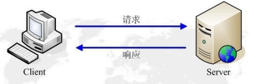

[TOC]
# HTTP

## 什么是Http

Hyper Text Transfer Protocol（超文本传输协议）的缩写,是用于从万维网（WWW:World Wide Web ）服务器传输超文本到本地浏览器的传送协议。

HTTP是一个基于TCP/IP通信协议来传递数据（HTML 文件, 图片文件, 查询结果等）。
HTTP是一个属于应用层的面向对象的协议，由于其简捷、快速的方式，适用于分布式超媒体信息系统。它于1990年提出，经过几年的使用与发展，得到不断地完善和扩展。目前在WWW中使用的是HTTP/1.0的第六版，HTTP/1.1的规范化工作正在进行之中，而且HTTP-NG(Next Generation of HTTP)的建议已经提出。

HTTP协议工作于客户端-服务端架构为上。浏览器作为HTTP客户端通过URL向HTTP服务端即WEB服务器发送所有请求。Web服务器根据接收到的请求后，向客户端发送响应信息。

# HTTP发展

## HTTP/0.9

是http请求的第一个版本，组成很简单，只允许客户端发送GET一种请求，不支持请求头。因为没有请求头，HTTP/0.9协议只支持一种内容，是纯文本。网页仍然支持HTML语言格式化，无法插入图片。

过程就是传输需要客户端到Web服务器建立TCP连接，由客户端发起，由服务器返回页面内容，然后关闭。如果页面不存在，不会返回任何错误码。

## HTTP/1.0

第一个在通讯中指定版本号的HTTP协议版本，至今还有被采用，相对于HTTP/0.9增加：

* 任何格式的内容都可以发送:
  * Content-Type: 服务器回应的时候告诉客户端数据类型是什么
  * Accept: 请求时用于指定客户端接收哪些类型的信息
  * Content-Encoding: 字段说明压缩方式
  * Accept-Encoding: 客户端在请求的时候说明自己可接受哪些压缩方式
* 引入了POST和HEAD请求
* 请求和回应的格式发生改变，除了数据部分，每次通信都必须包括头信息（HTTP header），用来描述一些元数据。
* 缺点： 每个TCP连接只能发送一个请求，发送数据完毕，连接就会关闭，如果还要请求其他资源，就必须在新建一个来你今儿。 解决方法就是有些浏览器在其请求时用一个非标准的Connection字段： keep-alive。

## HTTP/1.1

是现在使用广泛的协议版本，HTTP/1.1相对于HTTP/1.0 新增了：

* 默认为长链接： HTTP/1.1支持长链接和请求的流水线（管道机制）处理，在一个TCP链接上可以传送多个HTTP请求和响应，减少了建立和关闭链接的消耗和延迟，在HTTP/1.1中默认开启Connection: keep-alive,弥补了HTTP/1.0每次请求都要创建链接的缺点。
* 提供了范围请求功能： HTTP/1.0中有浪费带宽的现象，在请求头引入range头域，允许只请求部分资源，
* 将Content-length: 字段进行扩充（一个TCP链接现在可以传送多个回应）
* 采用分块传输编码，对于一些很耗时的动态操作，服务器需要等待所有操作执行完成，才能发送数据。采用"引流模式"替代"缓存模式"
* 新增许多方法： PUT、PATCH、HEAD、 OPTIONS、DELETE。另外，客户端请求的头信息新增了Host字段，用来指定服务器的域名。

* 缺点： 允许复用TCP连接，但是同一个TCP连接里面，所有的数据通信是按次序进行的。服务器只有处理完一个回应，才会进行下一个回应。要是前面的回应特别慢，后面就会有许多请求排队等着。这称为"队头堵塞"（Head-of-line blocking）。为了避免这个问题，只有两种方法：一是减少请求数，二是同时多开持久连接。这导致了很多的网页优化技巧，比如合并脚本和样式表、将图片嵌入CSS代码、域名分片（domain sharding）等等。如果HTTP协议设计得更好一些，这些额外的工作是可以避免的。

## HTTP2.0

HTTP/2（超文本传输协议第2版，最初命名为HTTP2.0），是HTTP协议的第二个主要版本。HTTP/2是HTTP协议自1999年HTTP1.1发布后的首个更新，主要基于SPDY协议。
HTTP2.0的特点是：在不改动HTTP语义、方法、状态码、URI及首部字段的情况下，大幅度提高了web性能。

* 二进制传输
  * HTTP2.0中所有加强性能的核心是二进制传输，在HTTP1.x中，我们是通过文本的方式传输数据。基于文本的方式传输数据存在很多缺陷，文本的表现形式有多样性，因此要做到健壮性考虑的场景必然有很多，但是二进制则不同，只有0和1的组合，因此选择了二进制传输，实现方便且健壮。在HTTP2.0中引入了新的编码机制，所有传输的数据都会被分割，并采用二进制格式编码
* 多路复用
  * 允许同时通过单一的HTTP/2.0 连接发起多重的请求-响应消息。有了新的分帧机制后，HTTP/2.0不再依赖多个TCP 连接去处理更多并发的请求。每个数据流都拆分成很多互不依赖的帧，而这些帧可以交错（乱序发送），还可以分优先级。最后再在另一端根据每个帧首部的流标识符把它们重新组合起来。HTTP 2.0 连接都是持久化的，而且客户端与服务器之间也只需要一个连接（每个域名一个连接）即可。

* 头部压缩
  * 使用了HPACK（HTTP2头部压缩算法）压缩格式对传输的header进行编码，减少了header的大小。并在两端维护了索引表，用于记录出现过的header，后面在传输过程中就可以传输已经记录过的header的键名，对端收到数据后就可以通过键名找到对应的值。

* 请求优先级
  * 浏览器可以在发现资源时立即分派请求，指定每个流的优先级，让服务器决定最优的响应次序。这样请求就不必排队了，既节省了时间，也最大限度地利用了每个连接。

* 服务端推送
  * 能把客户端所需要的资源伴随着index.html一起发送到客户端，省去了客户端重复请求的步骤。正因为没有发起请求，建立连接等操作，所以静态资源通过服务端推送的方式可以极大地提升速度。
